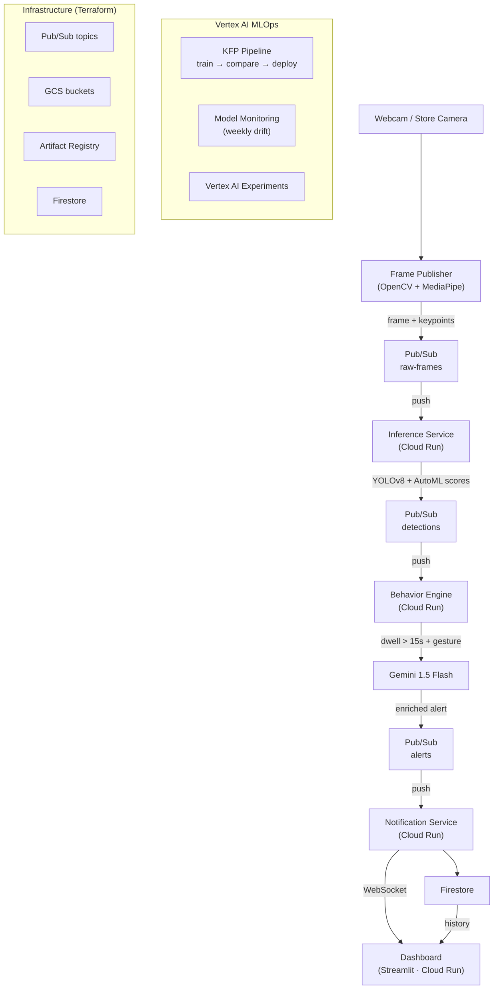

# HomeVision AI

Real-time customer assistance detection system built on GCP. Store cameras detect customers who may need help — YOLOv8 + MediaPipe analyse body language, Gemini enriches the alert, and employees receive push notifications on a live dashboard.

Built as a portfolio project to demonstrate production-grade MLOps, Computer Vision, and GCP architecture skills.

---

## Architecture



---

## Key Technologies

| Layer | Technology |
|-------|-----------|
| Computer Vision | YOLOv8n (Ultralytics), Vertex AI AutoML Object Detection |
| Pose / Behaviour | MediaPipe PoseLandmarker (Tasks API) |
| Generative AI | Gemini 1.5 Flash via Vertex AI |
| Serving | Cloud Run (4 services) |
| Messaging | Cloud Pub/Sub (3 topics) |
| Storage | Firestore (alerts), GCS (datasets + artifacts) |
| MLOps | Vertex AI Pipelines (KFP v2), Vertex AI Experiments, Model Monitoring |
| IaC | Terraform |
| CI/CD | Cloud Build |
| Package manager | [uv](https://docs.astral.sh/uv/) |
| Testing | pytest (38 tests, 100% mock-able) |

---

## Repository Layout

```
.
├── services/
│   ├── frame_publisher/       # OpenCV + MediaPipe, publishes to Pub/Sub
│   ├── inference_service/     # YOLOv8 + AutoML inference, FastAPI
│   ├── behavior_engine/       # Dwell tracker + Gemini enrichment, FastAPI
│   └── notification_service/  # WebSocket broadcast + Firestore, FastAPI
├── dashboard/                 # Streamlit — Live Feed / Alert History / Model Comparison
├── ml/
│   ├── data/                  # COCO download, YOLO format conversion, GCS upload
│   ├── training/
│   │   ├── yolov8/            # Custom container training job
│   │   └── automl/            # Vertex AI AutoML dataset + training scripts
│   └── pipelines/             # KFP v2 pipeline: ingest→train→compare→deploy
├── infra/                     # Terraform modules (Pub/Sub, GCS, AR, Firestore)
├── docs/
│   └── console-walkthroughs/  # Step-by-step GCP Console guides
├── cloudbuild.yaml            # CI/CD: lint → test → build → push → deploy
├── docker-compose.yml         # Local dev with MOCK_*=true
└── Makefile                   # make dev / test / infra-apply / endpoints-off
```

---

## Local Development

```bash
# 1. Install dependencies
uv sync --all-groups

# 2. Copy and fill in environment variables
cp .env.example .env

# 3. Start all services locally (mocked GCP clients)
make dev

# 4. Run all tests
make test
```

The dashboard opens at http://localhost:8501. All GCP calls are mocked — no credentials needed for local dev.

---

## Running the Full MLOps Pipeline

See [docs/console-walkthroughs/](docs/console-walkthroughs/) for step-by-step guides:

1. [Provision infrastructure](docs/console-walkthroughs/01-terraform-infra.md)
2. [Build and push Docker images](docs/console-walkthroughs/02-build-push-images.md)
3. [AutoML training](docs/console-walkthroughs/03-vertex-automl-training.md)
4. [YOLOv8 custom training](docs/console-walkthroughs/04-yolov8-custom-training.md)
5. [Run the KFP pipeline](docs/console-walkthroughs/05-vertex-pipeline.md)
6. [Deploy services to Cloud Run](docs/console-walkthroughs/06-deploy-cloud-run.md)

---

## Model Comparison

The KFP pipeline trains both models on the same dataset, compares `boundingBoxMeanAveragePrecision`, and automatically deploys the champion. Results are tracked in Vertex AI Experiments and visible on the **Model Comparison** tab of the dashboard.

| Model | Type | Target mAP50 |
|-------|------|-------------|
| YOLOv8n | Custom container | ~0.85 |
| AutoML | Vertex AI managed | ~0.70 |

---

## Cost Estimate

| Component | Estimated cost |
|-----------|---------------|
| AutoML training (1000 milli-node-hours) | ~$3–5 |
| YOLOv8 custom training (n1-standard-4, 30 epochs) | ~$0.50–1 |
| Cloud Run (per demo session) | ~$0.10 |
| Vertex AI endpoint (n1-standard-2, per hour) | ~$0.10 |
| **Total demo run** | **~$5–10** |

Run `make endpoints-off` after each demo to scale all services to zero.

---

## Alert Logic

An alert fires when all three conditions are true:

```
dwell_time > 15 seconds
AND head_turns > 2 (nose_x delta > 0.08 between frames)
AND (object_raised OR arm_extended)
```

Gemini 1.5 Flash then generates a context-aware message like:
> *"Customer in Aisle 7 has been standing for 25 seconds and appears to be examining a product. Consider offering assistance."*

---

## Stopping Services (Save Credits)

```bash
make endpoints-off   # scales Cloud Run services to 0
terraform destroy    # tears down all GCP infrastructure
```
